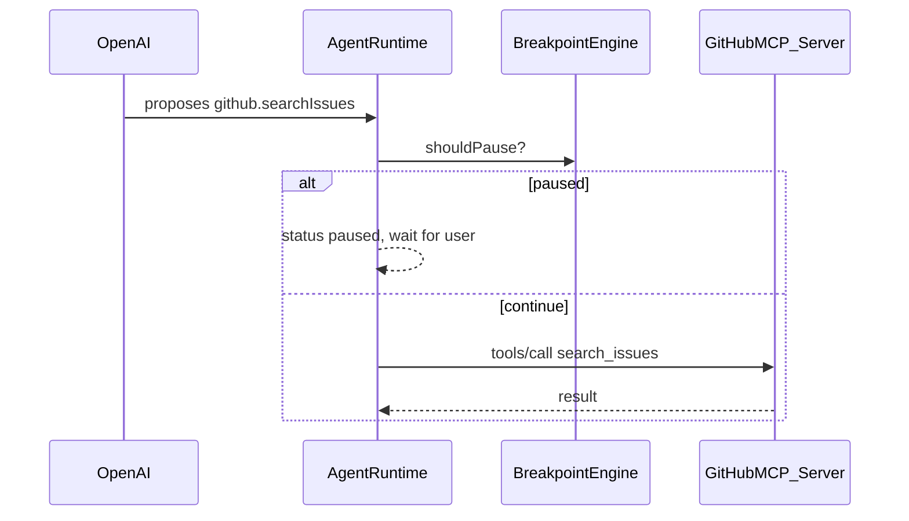

# Agent Debugger MVP Plan

## Project Goal

Build a local prototype of an agent execution debugger inspired by AgentStepper.

The app demonstrates how a developer can run an LLM-powered coding/API agent and pause execution at meaningful breakpoints before risky actions, such as file writes, GitHub mutations, or shell commands.

The core idea is not to build a full Cursor replacement. It is to prototype a control layer that sits between an LLM agent and its tools.

**Build strategy:** Mock tools and scripted events are **scaffolding** to ship the debugger shell quickly (MVP). Post-MVP:

* **Phase 2:** Real local filesystem + **in-app diff** when paused before a file write.
* **Phase 2b:** Real GitHub via **GitHub MCP** (same tool surface you use at work); debugger intercepts before each MCP call.
* **Phase 3 (stretch):** **State rewind** — step backward through agent execution, not just timeline inspection (see **State rewind** below).
* Shell stays mocked until later.

## Tech Stack

Backend:

* Node.js
* Express
* OpenAI API
* In-memory session store for MVP
* Mock tools for MVP (GitHub + filesystem + shell)
* Real local filesystem + diff UI in Phase 2 (post-MVP)
* GitHub MCP client in Phase 2b (post-MVP)

Frontend:

* Vite
* React
* Plain CSS or Semantic UI CSS
* No Redux
* No routing unless absolutely needed
* Use `useState`, `useEffect`, and `fetch`

## Architecture

```
React Frontend
  ↓
Express API
  ↓
Agent Runtime Loop
  ↓
Breakpoint Engine
  ↓
OpenAI LLM
  ↓
Tool Registry
  ↓
Mock Tools / Local Tools / GitHub MCP (intercepted)
```

Important principle:

The LLM does not execute tools directly.

The LLM proposes tool calls. The Express runtime receives those proposed tool calls, checks breakpoint rules, and only executes the tool if allowed.

## Core User Flow

1. User opens the React UI.
2. User enters a task, for example:

   * “Add a video metadata field to the Fox Local API and open a PR.”
3. User enables breakpoints:

   * After plan generation
   * Before file write
   * Before GitHub mutation
   * Before shell command
4. User clicks “Start Agent.”
5. Backend creates a session and starts the agent loop.
6. Agent generates status events and tool calls.
7. Frontend displays live timeline.
8. Agent proposes a risky tool call.
9. Runtime detects matching breakpoint.
10. Session pauses.
11. Frontend visually highlights breakpoint hit.
12. User can:

* **Continue** (run until next breakpoint) or **Step** (one atomic step in step mode)
* Reject with reason (tool_before)
* Edit assistant text, tool args, or tool result at pause

13. Runtime resumes agent loop.
14. Agent eventually completes with final answer.

## MVP Features

### Must Have

* Create session
* Start agent task
* Agent event timeline
* OpenAI tool-calling loop
* Tool registry
* Mock tools
* Breakpoint rules
* Pause before matching tool calls
* Resume from pause
* Reject paused tool call with reason
* Edit paused tool-call arguments
* Visual breakpoint hit state in React UI
* **Stepping mode** — pause after each atomic step (LLM turn, tool result); **Step** vs **Continue**
* **Live edit at pause** — edit assistant text after LLM; edit tool args before run; edit tool result before feeding back to model (AgentStepper parity)

### Nice to Have (MVP)

* Server-Sent Events instead of polling
* Export event trace as JSON

### Out of Scope for MVP

* In-app diff view (Phase 2)
* Real filesystem read/write (Phase 2)
* GitHub MCP execution (Phase 2b)
* Real Cursor IDE integration
* Arbitrary non-GitHub MCP servers (future)
* Real shell execution — future phase
* **State rewind** (undo agent state to a prior step) — post-MVP; MVP ⏮ only browses the timeline
* Authentication
* Persistent database
* Multi-user support
* Full codebase editing agent
* Raw chain-of-thought display

## Folder Structure

```
agent-debugger/
  backend/
    package.json
    server.js
    src/
      store/
        sessions.js
      agent/
        runAgentLoop.js
        runScriptedAgent.js
        scriptedSequence.js
        callOpenAI.js
        normalizeOpenAIResponse.js
      breakpoints/
        shouldPause.js
        shouldPauseForStep.js
        getPauseReason.js
        buildDiffPreview.js
      tools/
        registry.js
        runTool.js
        mockGithub.js
        mockFilesystem.js
      mcp/
        githubMcpClient.js
        githubToolMap.js
        realFilesystem.js
        mockShell.js
      routes/
        sessions.js

  frontend/
    package.json
    index.html
    src/
      main.jsx
      App.jsx
      api.js
      components/
        TaskForm.jsx
        BreakpointPanel.jsx
        AgentTimeline.jsx
        EventDetailsPanel.jsx
        DebuggerControlBar.jsx
        PausedInspectorCard.jsx
        DiffPanel.jsx
        StatusBanner.jsx
      styles.css
```

## Dev Setup

### Environment

* Backend reads `OPENAI_API_KEY` from `backend/.env` (use `dotenv`).
* Add `backend/.env.example` with:

  ```
  OPENAI_API_KEY=sk-...
  WORKSPACE_ROOT=/absolute/path/to/your/cloned-repo
  GITHUB_TOKEN=ghp_...
  GITHUB_OWNER=your-org-or-user
  GITHUB_REPO=your-repo-name
  GITHUB_MCP_COMMAND=npx
  GITHUB_MCP_ARGS=-y,@modelcontextprotocol/server-github
  ```

  `WORKSPACE_ROOT` is required for **Phase 2**. GitHub token/owner/repo are required for **Phase 2b** (passed through to the GitHub MCP server the same way Cursor does). Adjust `GITHUB_MCP_*` to match your work machine’s MCP config if different.

  MVP runs without any of these.
* Add `.env` to `.gitignore`.

### CORS

Enable CORS on Express so the Vite dev server (`http://localhost:5173`) can call the API (`http://localhost:3001` or similar). Use the `cors` package with default dev settings.

## Backend API Routes

Polling uses a **single** read endpoint: `GET /sessions/:id`. Do not maintain a separate `/events` route for MVP.

### `POST /sessions`

Create a new session.

Request:

```json
{
  "task": "Add a video metadata field to the Fox Local API and open a PR.",
  "agentMode": "scripted",
  "filesystemBackend": "mock",
  "githubBackend": "mock",
  "breakpoints": {
    "afterPlan": true,
    "pauseAfterLlm": false,
    "beforeFileWrite": true,
    "beforeGithubMutation": true,
    "beforeShellCommand": false
  },
  "executionControl": "run"
}
```

`agentMode` defaults to `"scripted"` until the OpenAI path is stable.

Response:

```json
{
  "sessionId": "abc123"
}
```

### `GET /sessions/:id`

**Primary polling endpoint.** Return full session state for the React UI.

Response:

```json
{
  "id": "abc123",
  "task": "...",
  "status": "paused",
  "breakpoints": {},
  "events": [],
  "pausedToolCall": null,
  "pauseContext": null,
  "diffPreview": null,
  "executionControl": "run",
  "finalAnswer": null
}
```

`pauseContext` describes what is paused (see **Stepping and live edit**). `executionControl` is `"run"` (semantic breakpoints only) or `"step"` (pause after each atomic step as well).

`diffPreview` is set when paused before `filesystem.writeFile` (Phase 2+). Shape: `{ "path": "...", "before": "...", "after": "..." }`.

Poll this every 500–1000 ms while a session is active.

### `POST /sessions/:id/start`

Start the agent runtime loop **asynchronously**.

Behavior:

1. Validate session exists and `status` is `idle` or `complete` (not already `running`).
2. Set `status` to `running`.
3. Kick off `runAgentLoop(session)` in the background (do not `await` it in the route handler).
4. Return immediately.

Response:

```json
{
  "status": "running"
}
```

If the session is already `running`, return `409` with `{ "error": "Agent loop already running" }`.

### `POST /sessions/:id/breakpoints`

Update breakpoints while the session exists.

Request:

```json
{
  "beforeFileWrite": true,
  "beforeGithubMutation": false
}
```

### `POST /sessions/:id/resume`

**Continue (run mode):** resolve the current pause and keep `executionControl: "run"` until the next semantic breakpoint or completion.

**Step (step mode):** use `POST /sessions/:id/step` instead — resolve the current pause, advance **one** atomic step, then pause again if still stepping.

Requires `status === "paused"`; otherwise return `409`.

For `pauseContext.kind === "tool_before"`, executes the paused tool after continue (unless reject/edit flows apply). For `llm_after` / `tool_after`, applies any pending edits and advances the loop.

Response:

```json
{
  "status": "running"
}
```

### `POST /sessions/:id/step`

Requires `status === "paused"` and `executionControl === "step"`.

Resolve the current pause (same as resume for that `pauseContext`), run until the **next** atomic step boundary, then pause again with updated `pauseContext`. Use for AgentStepper-style “one event at a time.”

Response:

```json
{
  "status": "paused",
  "pauseContext": { "kind": "llm_after", "...": "..." }
}
```

### `POST /sessions/:id/execution-control`

Switch run vs step while idle or paused.

Request:

```json
{
  "executionControl": "run"
}
```

### `POST /sessions/:id/edit-paused`

Edit mutable payload for the current pause (before continuing).

Requires `status === "paused"`.

Request examples:

```json
{
  "kind": "llm_after",
  "assistantContent": "I'll inspect the API model first, then search issues."
}
```

```json
{
  "kind": "tool_before",
  "args": { "path": "internal/api/videos.go", "content": "..." }
}
```

```json
{
  "kind": "tool_after",
  "result": { "issues": [{ "number": 1, "title": "Example" }] }
}
```

Does not execute the tool or advance the loop — only updates `pauseContext` / `pausedToolCall` / pending message append. User then hits Continue or Step.

### `POST /sessions/:id/reject`

Reject paused tool call and send rejection back into the agent loop as a tool result.

Requires `status === "paused"`; otherwise return `409`.

Request:

```json
{
  "reason": "Do not write the file yet. Inspect tests first."
}
```

### `POST /sessions/:id/edit-tool-call`

Edit paused tool-call args, execute edited call, and continue agent loop.

Requires `status === "paused"`; otherwise return `409`.

Request:

```json
{
  "args": {
    "path": "internal/api/videos.go",
    "content": "updated content"
  }
}
```

## Session Shape

Use an in-memory `Map` for MVP.

```js
{
  id: "abc123",
  task: "Add a video metadata field...",
  status: "idle" | "running" | "paused" | "complete" | "error",
  messages: [],
  events: [],
  breakpoints: {
    afterPlan: true,
    pauseAfterLlm: false,
    beforeFileWrite: true,
    beforeGithubMutation: true,
    beforeShellCommand: false
  },
  executionControl: "run",
  pausedToolCall: null,
  pauseContext: null,
  executionControl: "run" | "step",
  toolCallsExecuted: 0,
  agentMode: "scripted" | "openai",
  filesystemBackend: "mock" | "real",
  githubBackend: "mock" | "mcp",
  fileCache: {},
  diffPreview: null,
  scriptStep: 0,
  finalAnswer: null,
  createdAt: "...",
  updatedAt: "..."
}
```

`agentMode` is set at session creation (or via UI toggle). `scriptStep` indexes into `scriptedSequence.js`; advance it after each resume/reject/edit in scripted mode.

`toolCallsExecuted` counts tool calls that have been executed (not merely proposed). Used by the `afterPlan` breakpoint to detect the first proposed tool call.

`pauseContext` when `status === "paused"`:

```js
// After OpenAI returns (before tool runs or before final answer committed)
{ kind: "llm_after", assistantContent: "...", toolCalls: [...] }

// Before tool executes (semantic breakpoint or step mode)
{ kind: "tool_before", toolCall: { id, name, args } }

// After tool runs, before message appended to history (step mode / optional in run mode)
{ kind: "tool_after", toolCall: { id, name, args }, result: { ... } }
```

## Runtime Lifecycle and Concurrency

* Only one `runAgentLoop` may run per session at a time. `/start` and resume routes guard on `status`.
* The loop mutates `session.events`, `session.messages`, and `session.status` in place. Polling reads the same object; no locking needed for a single-user local demo.
* On unhandled errors inside `runAgentLoop`, set `status` to `"error"`, push an `error` event, and stop the loop.
* Resume/reject/edit routes set `status` to `"running"`, then call `runAgentLoop(session)` again in the background (same fire-and-forget pattern as `/start`).

## Tool Registry

Each tool should have metadata so the breakpoint engine can reason about it.

```js
export const toolRegistry = {
  "github.searchIssues": {
    namespace: "github",
    capability: "read",
    risk: "low",
    description: "Search GitHub issues"
  },

  "github.createPullRequest": {
    namespace: "github",
    capability: "write",
    risk: "medium",
    description: "Create a pull request"
  },

  "filesystem.readFile": {
    namespace: "filesystem",
    capability: "read",
    risk: "low",
    description: "Read a file"
  },

  "filesystem.writeFile": {
    namespace: "filesystem",
    capability: "write",
    risk: "high",
    description: "Write a file"
  },

  "shell.run": {
    namespace: "shell",
    capability: "execute",
    risk: "high",
    description: "Run shell command"
  }
};
```

## Mock Tools

Start with fake tools so the demo is reliable.

### `github.searchIssues`

Return fake issues.

```js
{
  "issues": [
    {
      "number": 123,
      "title": "Add video metadata to mobile API"
    }
  ]
}
```

### `filesystem.readFile`

Return fake Go API code.

Example fake file:

```go
package api

type VideoResponse struct {
    ID    string `json:"id"`
    Title string `json:"title"`
}
```

### `filesystem.writeFile`

Do not actually write to production files. Return a mock success result.

```json
{
  "success": true,
  "path": "internal/api/videos.go",
  "changedLines": 42
}
```

### `github.createPullRequest`

Return fake PR URL.

```json
{
  "success": true,
  "url": "https://github.com/example/fox-local-api/pull/123"
}
```

## Breakpoint Engine

Implement `shouldPause(session, toolCall)` and `getPauseReason(session, toolCall)`.

Check rules in this order (first match wins):

```js
export function shouldPause(session, toolCall) {
  const breakpoints = session.breakpoints;
  const toolMeta = toolRegistry[toolCall.name];

  if (!toolMeta) return false;

  // Pause before the first tool call so the user can review prior llm_response events as the "plan"
  if (breakpoints.afterPlan && session.toolCallsExecuted === 0) {
    return true;
  }

  // pauseAfterLlm is handled in the loop via pause({ kind: "llm_after" }), not here

  if (
    breakpoints.beforeFileWrite &&
    toolMeta.namespace === "filesystem" &&
    toolMeta.capability === "write"
  ) {
    return true;
  }

  if (
    breakpoints.beforeGithubMutation &&
    toolMeta.namespace === "github" &&
    toolMeta.capability === "write"
  ) {
    return true;
  }

  if (
    breakpoints.beforeShellCommand &&
    toolMeta.namespace === "shell"
  ) {
    return true;
  }

  return false;
}
```

`afterPlan` semantics: the model’s plan is the assistant text in `llm_response` events already on the timeline. When the first tool call is proposed, pause so the user can read that plan and approve the first action.

`getPauseReason` examples:

* “Paused after plan — review before first action”
* “Paused before file write”
* “Paused before GitHub mutation”
* “Paused before shell command”

### `buildDiffPreview(session, toolCall)` (Phase 2)

Implement in `backend/src/breakpoints/buildDiffPreview.js`. When pausing on `filesystem.writeFile`:

```js
{
  path: toolCall.args.path,
  before: session.fileCache[path] ?? (re-read from disk if filesystemBackend === "real"),
  after: toolCall.args.content
}
```

Maintain `session.fileCache[path]` whenever a `filesystem.readFile` tool result is recorded. Clear `diffPreview` on resume/reject. Recompute `after` when user edits write args via `/edit-tool-call` or `/edit-paused`.

## Stepping and Live Edit (AgentStepper parity)

High-value differentiators aligned with [AgentStepper](https://github.com/sola-st/AgentStepper): **stepwise execution** and **editing prompts/responses/tool I/O at pause** — not only “stop before dangerous tools.”

### Execution control: Run vs Step

| Mode | Behavior |
|------|----------|
| **Run** | Pause only on **semantic** breakpoints (`afterPlan`, `beforeFileWrite`, `beforeGithubMutation`, `beforeShellCommand`) and optional `llm_after` when enabled (see below). |
| **Step** | Additionally pause after every **atomic step** so the user can inspect one beat at a time. |

**Atomic steps** (boundaries where step mode may pause):

1. **`llm_after`** — OpenAI returned; assistant message / tool_calls available; tool **not** executed yet.
2. **`tool_after`** — Tool finished; result ready but **not** yet appended to `session.messages`.

Semantic breakpoints on `tool_before` still fire in both modes. In **step** mode, non-risky tools also pause at `tool_after` (and always at `llm_after`).

Implement `shouldPauseForStep(session, stepKind)` alongside `shouldPause(session, toolCall)`.

### Live edit at pause

| `pauseContext.kind` | User can edit | On Continue/Step |
|---------------------|---------------|------------------|
| `llm_after` | Assistant text (and optionally strip/change `tool_calls` JSON for advanced users) | Append edited assistant message to `session.messages`, then proceed to tool or final |
| `tool_before` | Tool `args` (existing `edit-tool-call` / `PausedInspectorCard`) | `runTool` with edited args |
| `tool_after` | Tool `result` JSON (simulate different tool output) | Append edited result as `role: "tool"` message |

**Prompt editing (llm_before):** Optional stretch — pause **before** `callOpenAI` with editable `session.messages` tail. Defer to post-MVP unless time; `llm_after` covers most prompt-engineering demos.

### UI: `DebuggerControlBar.jsx`

Shown when session is `paused` or `running` (disable Step when running).

* **Continue** — `POST /resume` with `executionControl: "run"` (run until next semantic breakpoint).
* **Step** — `POST /step` (only when `executionControl === "step"`).
* **Run / Step toggle** — `POST /execution-control`.
* **Transport bar (MVP):** ⏮ ▶ ⏸ ⏭ — play/pause/step forward plus timeline back. ⏮ / ← browse past events only; they do **not** rewind agent state (see **State rewind** post-MVP).
* Optional: **Reject** (tool_before only) stays on inspector card.

### UI: `PausedInspectorCard.jsx`

Replaces a tool-only card. Content depends on `pauseContext.kind`:

* **`llm_after`:** textarea for assistant content; show proposed `tool_calls` read-only or editable JSON; no Reject (use edit + Step).
* **`tool_before`:** existing tool card + `DiffPanel` when applicable; Continue / Reject / Edit.
* **`tool_after`:** editable `result` JSON; Step to feed edited result into history.

### Agent loop changes (conceptual)

```js
// Before callOpenAI — optional llm_before (stretch)

const response = await callOpenAI(session.messages);
const normalized = normalizeOpenAIResponse(response);

if (session.executionControl === "step" || breakpoints.pauseAfterLlm) {
  return pause(session, { kind: "llm_after", ... });
}

// ... tool proposed ...
if (shouldPause(session, toolCall)) {
  return pause(session, { kind: "tool_before", toolCall });
}

const result = await runTool(toolCall);

if (session.executionControl === "step") {
  return pause(session, { kind: "tool_after", toolCall, result });
}

session.messages.push({ role: "tool", ... });
```

Add optional breakpoint checkbox: **Pause after each LLM response** (`pauseAfterLlm`) for run mode without full stepping.

### Scripted mode

Scripted agent must honor `executionControl` and emit the same `pauseContext` kinds so stepping/edit can be rehearsed without OpenAI.

### Demo talking point (add)

“Unlike prompt-only guardrails, you can **step** through the trajectory and **rewrite** what the model said or what the tool returned before the agent continues — same idea as AgentStepper’s live editing.”

## Agent Runtime Loop

The runtime loop owns execution.

Pseudo-code:

```js
export async function runAgentLoop(session) {
  try {
    session.status = "running";

    while (session.status === "running") {
      const response = await callOpenAI(session.messages);
      const normalized = normalizeOpenAIResponse(response);

      session.events.push({
        id: crypto.randomUUID(),
        type: "llm_response",
        message: normalized.statusMessage || "Model responded",
        createdAt: new Date().toISOString()
      });

      // Append assistant message(s) from normalized output to session.messages
      session.messages.push(...normalized.messagesToAppend);

      if (normalized.type === "final") {
        session.status = "complete";
        session.finalAnswer = normalized.content;
        session.events.push({
          id: crypto.randomUUID(),
          type: "complete",
          message: "Agent completed task",
          createdAt: new Date().toISOString()
        });
        return;
      }

      if (normalized.type === "tool_call") {
        const toolCall = normalized.toolCall;

        session.events.push({
          id: crypto.randomUUID(),
          type: "tool_call_proposed",
          message: `Proposed tool call: ${toolCall.name}`,
          toolCall,
          createdAt: new Date().toISOString()
        });

      if (shouldPause(session, toolCall)) {
        session.status = "paused";
        session.pausedToolCall = toolCall;
        session.pauseContext = { kind: "tool_before", toolCall };
        session.diffPreview = buildDiffPreview(session, toolCall);
        session.events.push({
            id: crypto.randomUUID(),
            type: "breakpoint_hit",
            message: getPauseReason(session, toolCall),
            toolCall,
            createdAt: new Date().toISOString()
          });
          return;
        }

        const result = await runTool(toolCall);
        session.toolCallsExecuted += 1;

        session.events.push({
          id: crypto.randomUUID(),
          type: "tool_result",
          message: `Tool completed: ${toolCall.name}`,
          toolCall,
          result,
          createdAt: new Date().toISOString()
        });

        session.messages.push({
          role: "tool",
          tool_call_id: toolCall.id,
          content: JSON.stringify(result)
        });
      }
    }
  } catch (err) {
    session.status = "error";
    session.events.push({
      id: crypto.randomUUID(),
      type: "error",
      message: err.message || "Agent loop failed",
      createdAt: new Date().toISOString()
    });
  }
}
```

On resume/reject/edit, increment `toolCallsExecuted` only when a tool is actually executed (resume and edit paths), not on reject.

## OpenAI Integration

Use OpenAI Chat Completions with tool/function calling.

The model should receive:

* System message
* User task
* Full `session.messages` history (assistant, tool, and user roles)
* Tool definitions

### `normalizeOpenAIResponse.js`

This module is the boundary between the OpenAI SDK and the agent loop. Responsibilities:

1. Call `openai.chat.completions.create` with `tools` and `messages`.
2. Read `choice.message` from the response.
3. Return a normalized shape the loop can branch on:

```js
// Final text response (no tool calls)
{ type: "final", content: "...", statusMessage: "...", messagesToAppend: [{ role: "assistant", content: "..." }] }

// Single tool call (MVP handles one per turn)
{
  type: "tool_call",
  statusMessage: "...",
  toolCall: { id: "call_abc", name: "filesystem.readFile", args: { path: "..." } },
  messagesToAppend: [{ role: "assistant", content: "...", tool_calls: [...] }]
}
```

4. Parse `tool_calls[0].function.arguments` from JSON string into `args`.
5. If the model returns **multiple** `tool_calls`, log a warning and **only process the first** for MVP. The system prompt should ask for one tool call at a time.

### Message history rules

* After a tool call proposal, append the full OpenAI `assistant` message (including `tool_calls`) via `messagesToAppend`.
* After executing a tool, append `{ role: "tool", tool_call_id, content }` — use `tool_call_id`, not `name`.
* On reject, append a tool message with the same `tool_call_id` and content like `{ "rejected": true, "reason": "..." }`.

### System prompt

```
You are a coding/API agent working on a mock Fox Local backend API.
Use tools to inspect files, propose code changes, and create a mock PR.
Before each tool call, provide a concise public status message in your assistant text.
Make exactly one tool call per turn. Wait for the tool result before calling the next tool.
Do not reveal hidden chain-of-thought.
When the task is complete, respond with a concise final summary and no further tool calls.
```

Important:

* Do not try to display raw chain-of-thought.
* Display public status messages, tool calls, tool args, tool results, diffs, and final answer.

## OpenAI Tool Definitions

Define tools matching the registry. OpenAI `function.name` values must match registry keys (e.g. `filesystem.readFile`).

Tools:

* `github.searchIssues`
* `filesystem.readFile`
* `filesystem.writeFile`
* `github.createPullRequest`
* optionally `shell.run`

The backend maps OpenAI tool calls to local JS tool functions via `runTool`.

## Resume Flow

When user clicks Continue:

1. Backend reads `session.pausedToolCall`.
2. Backend executes it with `runTool`.
3. Backend increments `toolCallsExecuted`.
4. Backend appends `{ role: "tool", tool_call_id: pausedToolCall.id, content: ... }` to `session.messages`.
5. Backend clears `pausedToolCall`.
6. Backend sets status to `running`.
7. Backend restarts `runAgentLoop(session)` in the background.

## Reject Flow

When user clicks Reject:

1. Backend reads `session.pausedToolCall`.
2. Backend does not execute the tool.
3. Backend increments `toolCallsExecuted` (the proposal was resolved in the conversation).
4. Backend appends a tool message with `tool_call_id: pausedToolCall.id`:

```json
{
  "rejected": true,
  "reason": "User rejected this action."
}
```

5. Backend clears `pausedToolCall`.
6. Backend sets status to `running`.
7. Backend restarts `runAgentLoop(session)` in the background.

## Edit Tool Call Flow

When user edits tool args:

1. Backend reads `session.pausedToolCall`.
2. Backend replaces `args` with user-submitted args.
3. Backend records event `tool_call_edited`.
4. Backend executes edited tool call.
5. Backend increments `toolCallsExecuted`.
6. Backend appends tool result to `session.messages` (with `tool_call_id`).
7. Backend clears `pausedToolCall`, sets status to `running`, and restarts `runAgentLoop` in the background.

## Frontend Components

### `App.jsx`

Responsible for:

* Creating session
* Holding `sessionId`
* Polling session events
* Rendering layout

State:

```js
const [session, setSession] = useState(null);
const [events, setEvents] = useState([]);
const [selectedEvent, setSelectedEvent] = useState(null);
const [pausedToolCall, setPausedToolCall] = useState(null);
```

### `TaskForm.jsx`

Fields:

* Task textarea
* Start button

Default task:

```
Add a new video metadata field to the Fox Local mobile API and open a mock PR.
```

### `BreakpointPanel.jsx`

Checkboxes:

* After plan generation
* Pause after each LLM response (`pauseAfterLlm` — useful in run mode)
* Before file write
* Before GitHub mutation
* Before shell command

Calls:

```js
POST /sessions/:id/breakpoints
```

### `AgentTimeline.jsx`

Displays events as a vertical timeline.

Event styles:

* `task_started`: blue
* `llm_response`: gray
* `tool_call_proposed`: teal
* `tool_result`: green
* `breakpoint_hit`: yellow/orange, pulsing
* `complete`: green
* `error`: red
* `tool_call_edited`: purple

Clicking an event selects it.

### `EventDetailsPanel.jsx`

Shows JSON details for selected event.

Fields:

* Type
* Message
* Created At
* Tool Call
* Args
* Result

### `DebuggerControlBar.jsx`

Run / Step toggle, **Continue**, **Step** buttons. Calls `/execution-control`, `/resume`, `/step`.

### `PausedInspectorCard.jsx`

Only visible when `session.status === "paused"`. Renders by `pauseContext.kind` (see **Stepping and live edit**):

* **`llm_after`:** editable assistant text; proposed tool calls
* **`tool_before`:** tool name, risk, editable args, optional `DiffPanel`, Reject
* **`tool_after`:** editable tool result JSON

Works with `POST /edit-paused` before Continue/Step.

### `DiffPanel.jsx` (Phase 2)

Shown when `session.diffPreview` is non-null (paused before a file write).

Compares **current file content** vs **proposed content** from `pausedToolCall.args.content`:

* **Before:** from `session.fileCache[path]` (populated on each `filesystem.readFile` tool result) or a fresh `readFile` from disk at pause time if cache miss.
* **After:** proposed `content` from the write tool call (updates live if user edits args in `PausedToolCallCard`).

UI options (pick one for MVP of diff):

* Side-by-side `<pre>` blocks with line numbers, or
* Simple unified diff via a small library (e.g. `diff` npm package on the frontend).

Does **not** require GitHub. This is the primary diff experience you want for reviewing agent edits before they land on disk.

### `StatusBanner.jsx`

Shows current state:

* Idle
* Running
* Paused
* Complete
* Error

When paused, show large visual banner:

```
⏸ Agent paused at breakpoint
```

## Frontend Polling

Poll `GET /sessions/:id` every 500–1000 ms.

```js
useEffect(() => {
  if (!sessionId) return;

  const interval = setInterval(async () => {
    const data = await getSession(sessionId);
    setEvents(data.events);
    setPausedToolCall(data.pausedToolCall);
    setSessionStatus(data.status);
  }, 1000);

  return () => clearInterval(interval);
}, [sessionId]);
```

Do not use WebSockets unless time remains.

## UI Layout

Use a three-column debugger layout:

```
 -------------------------------------------------------
| Agent Debugger                                        |
 -------------------------------------------------------
| Left Panel       | Timeline           | Details Panel |
|                  |                    |               |
| Task             | Event 1            | Selected JSON  |
| Breakpoints      | Event 2            | Tool Args      |
| Start Button     | Breakpoint Hit     | Result         |
|                  | Event 4            |               |
 -------------------------------------------------------
| Paused Tool Call Card, visible only when paused        |
 -------------------------------------------------------
```

## Visual Breakpoint Effect

When a breakpoint hits:

* Show yellow/orange status banner
* Pulse the paused card
* Highlight timeline event
* Scroll paused card into view

CSS:

```css
.breakpoint-pulse {
  animation: breakpointPulse 1.2s ease-in-out infinite;
  border: 2px solid #f2c037;
}

@keyframes breakpointPulse {
  0% {
    box-shadow: 0 0 0 0 rgba(242, 192, 55, 0.7);
    transform: scale(1);
  }

  70% {
    box-shadow: 0 0 0 12px rgba(242, 192, 55, 0);
    transform: scale(1.01);
  }

  100% {
    box-shadow: 0 0 0 0 rgba(242, 192, 55, 0);
    transform: scale(1);
  }
}
```

## Demo Scenario

Use this task:

```
Add a backward-compatible `durationSeconds` metadata field to the Fox Local mobile video API response and open a mock PR.
```

Expected agent trajectory (with default breakpoints enabled):

1. Agent starts task.
2. Agent produces public status:

   * “I’ll inspect the video API response model and route handler first.”
3. Agent proposes `github.searchIssues` (first tool call).
4. If `afterPlan` is enabled, breakpoint hits — user reviews plan text on timeline, then continues.
5. Tool executes; agent calls `filesystem.readFile`.
6. Agent proposes `filesystem.writeFile`.
7. Breakpoint hits before file write.
8. UI shows proposed file change.
9. User clicks Continue.
10. Tool executes.
11. Agent proposes `github.createPullRequest`.
12. Breakpoint hits before GitHub mutation.
13. UI shows PR title/body.
14. User edits PR body or clicks Continue.
15. Agent completes.

## Scripted Mode Event Sequence

Golden reference for **Days 2–5** and for **Scripted Demo Mode** fallback. Implement in [`backend/src/agent/scriptedSequence.js`](backend/src/agent/scriptedSequence.js) and drive from [`backend/src/agent/runScriptedAgent.js`](backend/src/agent/runScriptedAgent.js).

### How the scripted runner works

* `/start` calls `runScriptedAgent(session)` when `session.agentMode === "scripted"`.
* The runner advances through **script steps** stored in `scriptedSequence.js`. It reuses `shouldPause`, `getPauseReason`, and `runTool` — same paths as the real agent loop.
* On each step, push the listed event(s), update `session.status`, and **return** when a breakpoint pauses (do not auto-continue).
* On `/resume`, `/reject`, or `/edit-tool-call`, perform the normal mutation flow, increment `session.scriptStep`, then call `runScriptedAgent(session)` again to play the next steps.
* Event `id` values below are stable IDs for tests and docs; implementation may use these literals or generate UUIDs, but **`type`, `message`, `toolCall`, and `result` must match**.

Default demo task (must match `TaskForm` default):

```
Add a backward-compatible `durationSeconds` metadata field to the Fox Local mobile video API response and open a mock PR.
```

Default breakpoints for scripted demo: `afterPlan: true`, `beforeFileWrite: true`, `beforeGithubMutation: true`, `beforeShellCommand: false`.

### Script step map

| Step | Trigger | Action | Ends with |
|------|---------|--------|-----------|
| 0 | `/start` | Push `task_started` + plan `llm_response` + propose `github.searchIssues` | Pause if `afterPlan` |
| 1 | Resume step 0 | Execute search, push `tool_result`, status `llm_response`, propose `readFile`, execute read, push `tool_result`, status `llm_response`, propose `writeFile` | Pause if `beforeFileWrite` |
| 2 | Resume step 1 | Execute write, push `tool_result`, status `llm_response`, propose `createPullRequest` | Pause if `beforeGithubMutation` |
| 3 | Resume step 2 | Execute PR, push `tool_result`, final `llm_response`, `complete` | `status: complete` |

### Phase 0 — on `/start` (through first pause)

Push in order:

```json
{
  "id": "scripted-001",
  "type": "task_started",
  "message": "Starting Fox Local API task (scripted mode)",
  "createdAt": "2026-06-03T12:00:00.000Z"
}
```

```json
{
  "id": "scripted-002",
  "type": "llm_response",
  "message": "I'll search existing issues, read the video response model, add durationSeconds, then open a mock PR.",
  "createdAt": "2026-06-03T12:00:01.000Z"
}
```

```json
{
  "id": "scripted-003",
  "type": "tool_call_proposed",
  "message": "Proposed tool call: github.searchIssues",
  "toolCall": {
    "id": "call_scripted_1",
    "name": "github.searchIssues",
    "args": {
      "query": "durationSeconds video metadata",
      "repo": "fox-local-api"
    }
  },
  "createdAt": "2026-06-03T12:00:02.000Z"
}
```

If `shouldPause` returns true for this tool call:

```json
{
  "id": "scripted-004",
  "type": "breakpoint_hit",
  "message": "Paused after plan — review before first action",
  "toolCall": {
    "id": "call_scripted_1",
    "name": "github.searchIssues",
    "args": {
      "query": "durationSeconds video metadata",
      "repo": "fox-local-api"
    }
  },
  "createdAt": "2026-06-03T12:00:03.000Z"
}
```

Then set `session.status = "paused"`, `session.pausedToolCall` to the `github.searchIssues` tool call above, `session.scriptStep = 0`, and **return**.

If `afterPlan` is disabled, do not pause; run `runTool` immediately and continue to Phase 1 events in the same `/start` invocation.

### Phase 1 — after resume from step 0 (through file-write pause)

On resume, execute paused `github.searchIssues`, increment `toolCallsExecuted`, append tool message, then push:

```json
{
  "id": "scripted-005",
  "type": "tool_result",
  "message": "Tool completed: github.searchIssues",
  "toolCall": { "id": "call_scripted_1", "name": "github.searchIssues", "args": { "query": "durationSeconds video metadata", "repo": "fox-local-api" } },
  "result": {
    "issues": [{ "number": 123, "title": "Add video metadata to mobile API" }]
  },
  "createdAt": "2026-06-03T12:00:10.000Z"
}
```

```json
{
  "id": "scripted-006",
  "type": "llm_response",
  "message": "Found a related issue. Reading internal/api/videos.go next.",
  "createdAt": "2026-06-03T12:00:11.000Z"
}
```

```json
{
  "id": "scripted-007",
  "type": "tool_call_proposed",
  "message": "Proposed tool call: filesystem.readFile",
  "toolCall": {
    "id": "call_scripted_2",
    "name": "filesystem.readFile",
    "args": { "path": "internal/api/videos.go" }
  },
  "createdAt": "2026-06-03T12:00:12.000Z"
}
```

No pause on read (`capability: read`). Execute immediately and push:

```json
{
  "id": "scripted-008",
  "type": "tool_result",
  "message": "Tool completed: filesystem.readFile",
  "toolCall": { "id": "call_scripted_2", "name": "filesystem.readFile", "args": { "path": "internal/api/videos.go" } },
  "result": {
    "path": "internal/api/videos.go",
    "content": "package api\n\ntype VideoResponse struct {\n\tID    string `json:\"id\"`\n\tTitle string `json:\"title\"`\n}\n"
  },
  "createdAt": "2026-06-03T12:00:13.000Z"
}
```

```json
{
  "id": "scripted-009",
  "type": "llm_response",
  "message": "Adding durationSeconds to VideoResponse for backward-compatible metadata.",
  "createdAt": "2026-06-03T12:00:14.000Z"
}
```

```json
{
  "id": "scripted-010",
  "type": "tool_call_proposed",
  "message": "Proposed tool call: filesystem.writeFile",
  "toolCall": {
    "id": "call_scripted_3",
    "name": "filesystem.writeFile",
    "args": {
      "path": "internal/api/videos.go",
      "content": "package api\n\ntype VideoResponse struct {\n\tID              string `json:\"id\"`\n\tTitle           string `json:\"title\"`\n\tDurationSeconds int    `json:\"durationSeconds,omitempty\"`\n}\n"
    }
  },
  "createdAt": "2026-06-03T12:00:15.000Z"
}
```

```json
{
  "id": "scripted-011",
  "type": "breakpoint_hit",
  "message": "Paused before file write",
  "toolCall": {
    "id": "call_scripted_3",
    "name": "filesystem.writeFile",
    "args": {
      "path": "internal/api/videos.go",
      "content": "package api\n\ntype VideoResponse struct {\n\tID              string `json:\"id\"`\n\tTitle           string `json:\"title\"`\n\tDurationSeconds int    `json:\"durationSeconds,omitempty\"`\n}\n"
    }
  },
  "createdAt": "2026-06-03T12:00:16.000Z"
}
```

Set `session.status = "paused"`, `session.pausedToolCall` to the write tool call, `session.scriptStep = 1`, return.

### Phase 2 — after resume from step 1 (through PR pause)

Execute paused `filesystem.writeFile`, then push:

```json
{
  "id": "scripted-012",
  "type": "tool_result",
  "message": "Tool completed: filesystem.writeFile",
  "toolCall": { "id": "call_scripted_3", "name": "filesystem.writeFile", "args": { "path": "internal/api/videos.go", "content": "..." } },
  "result": { "success": true, "path": "internal/api/videos.go", "changedLines": 4 },
  "createdAt": "2026-06-03T12:00:20.000Z"
}
```

```json
{
  "id": "scripted-013",
  "type": "llm_response",
  "message": "File updated. Opening a mock pull request.",
  "createdAt": "2026-06-03T12:00:21.000Z"
}
```

```json
{
  "id": "scripted-014",
  "type": "tool_call_proposed",
  "message": "Proposed tool call: github.createPullRequest",
  "toolCall": {
    "id": "call_scripted_4",
    "name": "github.createPullRequest",
    "args": {
      "title": "Add durationSeconds to video API response",
      "body": "Adds optional durationSeconds field to VideoResponse for backward-compatible mobile metadata.",
      "head": "feat/video-duration-seconds",
      "base": "main"
    }
  },
  "createdAt": "2026-06-03T12:00:22.000Z"
}
```

```json
{
  "id": "scripted-015",
  "type": "breakpoint_hit",
  "message": "Paused before GitHub mutation",
  "toolCall": {
    "id": "call_scripted_4",
    "name": "github.createPullRequest",
    "args": {
      "title": "Add durationSeconds to video API response",
      "body": "Adds optional durationSeconds field to VideoResponse for backward-compatible mobile metadata.",
      "head": "feat/video-duration-seconds",
      "base": "main"
    }
  },
  "createdAt": "2026-06-03T12:00:23.000Z"
}
```

Set `session.status = "paused"`, `session.pausedToolCall` to the PR tool call, `session.scriptStep = 2`, return.

### Phase 3 — after resume from step 2 (complete)

Execute paused `github.createPullRequest`, then push:

```json
{
  "id": "scripted-016",
  "type": "tool_result",
  "message": "Tool completed: github.createPullRequest",
  "toolCall": { "id": "call_scripted_4", "name": "github.createPullRequest", "args": { "title": "Add durationSeconds to video API response", "body": "...", "head": "feat/video-duration-seconds", "base": "main" } },
  "result": { "success": true, "url": "https://github.com/example/fox-local-api/pull/456" },
  "createdAt": "2026-06-03T12:00:30.000Z"
}
```

```json
{
  "id": "scripted-017",
  "type": "llm_response",
  "message": "Done. Added durationSeconds to VideoResponse and opened mock PR #456.",
  "createdAt": "2026-06-03T12:00:31.000Z"
}
```

```json
{
  "id": "scripted-018",
  "type": "complete",
  "message": "Agent completed task",
  "createdAt": "2026-06-03T12:00:32.000Z"
}
```

Set `session.status = "complete"`, `session.finalAnswer = "Added durationSeconds to VideoResponse and opened mock PR #456."`, `session.scriptStep = 3`, return.

### Optional timing

For a “live” feel during demo, add `await delay(400)` between event pushes in scripted mode only. Keep delays under 500 ms so polling still feels responsive.

### Reject and edit in scripted mode

* **Reject** at any pause: use the normal reject flow (synthetic tool result). Advance `scriptStep` and call `runScriptedAgent` again. For MVP scripted fallback, it is acceptable to push a single extra `llm_response` (“User rejected that action; adjusting approach.”) and then re-propose the **same** tool call on the next step, or skip to the next phase if you want a shorter fallback demo.
* **Edit** at PR pause: user changes `args.body` in `PausedToolCallCard`; `/edit-tool-call` executes with edited args; Phase 3 `tool_result.url` unchanged.

### UI toggle

Expose **Scripted Demo Mode** vs **OpenAI Agent Mode** in the left panel. New sessions default to `scripted` until Day 7 OpenAI path is stable; then default to `openai` with scripted as fallback.

Phase 2+ also expose **Filesystem** and **GitHub** backend toggles (mock vs real) in the left panel.

## Demo Talking Points

Use these points in the final presentation:

1. “Cursor-style approval dialogs are useful, but they are mostly permission gates.”
2. “This prototype treats agent execution more like a debugger.”
3. “The runtime can pause at semantic breakpoints like file writes, GitHub mutations, shell commands, or large diffs.”
4. “The LLM proposes actions, but the runtime owns execution.”
5. “The user can step through execution, edit what the model said or what a tool returned, and inspect or reject proposed actions before they happen.”
6. “This is especially useful with fast models because errors can compound quickly.”
7. “In production, this is how you’d wrap GitHub MCP (or any MCP): the agent proposes `search_issues` / `create_pull_request`, the debugger pauses, then the runtime invokes MCP — not the model directly.”

## Two-Week Execution Plan

### Day 1

* Create repo structure
* Create Express backend
* Create React frontend with Vite
* Add CORS, `dotenv`, and `.env.example`
* Add basic health check route
* Add session store
* Add `POST /sessions`
* Add `GET /sessions/:id` (single polling endpoint)

### Day 2

* Add `runScriptedAgent.js` and `scriptedSequence.js` per **Scripted Mode Event Sequence**
* Add mock agent loop without OpenAI (script steps 0–3, pause on resume)
* Add event timeline
* Add async `POST /sessions/:id/start` (fire-and-forget loop)
* Wire frontend polling to `GET /sessions/:id`

Goal:

* Start a session and see timeline events appear.

### Day 3

* Add tool registry
* Add mock tools
* Add `runTool`
* Add breakpoint engine (`afterPlan`, file write, GitHub, shell)
* Add `toolCallsExecuted` to session
* Add pause before first tool (`afterPlan`) and before `filesystem.writeFile`

Goal:

* Agent pauses after plan (first tool) and before a mock file write.

### Day 4

* Add resume route
* Add reject route
* Add frontend buttons for Continue and Reject
* Add paused tool-call card

Goal:

* Pause, continue, reject flow works with scripted agent.

### Day 5

* Add React event timeline
* Add selected event detail panel
* Add breakpoint panel
* Add visual breakpoint effect

Goal:

* UI feels like a debugger.

### Day 6

* Add OpenAI integration (`callOpenAI`, `normalizeOpenAIResponse`)
* Define OpenAI tools and correct `tool_call_id` message history
* Replace scripted agent with model-driven tool calls
* Keep scripted fallback in case OpenAI output is inconsistent

Goal:

* Model proposes at least one tool call with valid message history.

### Day 7

* Stabilize OpenAI agent loop
* Improve system prompt (“one tool call per turn”)
* Add top-level error handling (`error` events in timeline)
* Ensure final answer path works

Goal:

* End-to-end OpenAI-driven demo works reliably.

### Day 8

* **Stepping:** `executionControl`, `pauseContext`, `shouldPauseForStep`, `POST /step`, `POST /execution-control`
* `DebuggerControlBar.jsx` (Continue / Step / Run↔Step)
* Scripted mode honors step pauses at `llm_after` and `tool_after`

Goal:

* Step through a scripted run one atomic step at a time.

### Day 9

* **Live edit:** `POST /edit-paused`, `PausedInspectorCard` for `llm_after` + `tool_before` + `tool_after`
* `pauseAfterLlm` breakpoint checkbox
* Edit tool-call args (`/edit-tool-call` can delegate to same inspector)
* Add mock GitHub PR tool + breakpoint before GitHub mutation

Goal:

* Edit assistant text or tool result at pause, then Step/Continue; full demo scenario works.

### Day 10

* Polish UI
* Add status banner
* Add event colors
* Add demo reset button
* Improve error handling

Goal:

* Demo looks clean.

### Day 11

* **Phase 2:** `realFilesystem.js`, `WORKSPACE_ROOT`, path sandbox, `fileCache`, `buildDiffPreview`
* `DiffPanel.jsx` on file-write pause

### Day 12

* UI toggles: filesystem Mock | Real
* Smoke-test read → diff → continue → write on local clone
* README (workspace + diff behavior)

### Day 13

* **Phase 2b:** `githubMcpClient.js`, spawn GitHub MCP (stdio), `githubToolMap`
* UI toggle GitHub Mock | MCP
* Intercept → `search_issues` / `create_pull_request` via MCP after breakpoint

### Day 14

* End-to-end: real file edit with diff, then real PR (or rehearse with GitHub mock if token blocked)
* Presentation prep: 2-minute + 5-minute walkthrough
* Practice full demo flow

### Post-MVP backlog (not scheduled)

* **State rewind** — checkpoint/restore session at prior atomic steps; see **State rewind (post-MVP idea)** under Future phase.

---

## Phase 2: Real Filesystem + In-App Diff (post-MVP)

**Timeline:** After MVP is demo-ready (Days 1–10); start Days 11–12.

**Goal:** Real `filesystem.readFile` / `writeFile` on a local clone, plus a **diff panel** at the file-write breakpoint so you can compare before/after **without GitHub**.

GitHub stays mock in Phase 2.

### What you need

1. **Any git repo cloned locally** (your project or a small sample repo).
2. **`WORKSPACE_ROOT`** in `backend/.env` (absolute path to clone root).
3. Tasks and tool paths under that root.

You do **not** need GitHub wired up to compare diffs — the diff is **local file vs proposed write**.

### Backend toggles

```js
filesystemBackend: "mock" | "real"   // default "mock"
githubBackend: "mock"                // still mock in Phase 2
```

`runTool` dispatches filesystem tools by `filesystemBackend`; GitHub always uses `mockGithub.js` until Phase 2b.

UI (left panel): **Filesystem: Mock | Real** (GitHub toggle added in 2b).

### `realFilesystem.js`

* **`readFile`:** read under `WORKSPACE_ROOT`; return `{ path, content }`; update `session.fileCache[path]`.
* **`writeFile`:** sandboxed write after user continues past breakpoint.
* **Path sandbox:** reject paths that escape `WORKSPACE_ROOT`.

### Diff flow (core Phase 2 feature)

1. Agent runs `readFile` → content stored in `session.fileCache[path]` and shown in timeline.
2. Agent proposes `writeFile` → `beforeFileWrite` breakpoint fires.
3. Backend sets `session.diffPreview` via `buildDiffPreview`.
4. Frontend `DiffPanel` shows before vs after; editing args in `PausedToolCallCard` updates the “after” side.
5. User continues → file written to disk.

### Phase 2 checklist

* `realFilesystem.js`, `resolveWorkspacePath`, `fileCache`, `buildDiffPreview`
* `DiffPanel.jsx` + wire into `PausedToolCallCard`
* Include `diffPreview` in `GET /sessions/:id`
* Clear `diffPreview` on resume/reject
* README: clone repo, `WORKSPACE_ROOT`, how diff works

### Phase 2 definition of done

* Real read/write on local clone with sandboxing.
* Paused file write shows **in-app diff** (before vs proposed).
* GitHub still mock; PR step unchanged for demo narrative.

---

## Phase 2b: GitHub MCP (intercepted calls)

**Timeline:** Immediately after Phase 2 filesystem + diff are stable (e.g. Days 13–14+).

**Goal:** Execute GitHub actions through the **GitHub MCP server** you already use at work. The Agent Debugger does **not** call the GitHub REST API directly — it acts as an **MCP client** and intercepts tool calls at breakpoints **before** forwarding them to MCP.

This is a strong demo story: “Same MCP tools as Cursor, but with debugger breakpoints in front.”

### Intercept flow



The LLM still sees stable agent tool names (`github.searchIssues`). The runtime maps them to MCP tool names and invokes MCP only after approval.

### Agent tool → GitHub MCP tool map

Implement in `backend/src/mcp/githubToolMap.js`:

| Agent registry key | GitHub MCP tool | Notes |
|--------------------|-----------------|-------|
| `github.searchIssues` | `search_issues` | Map `args.query`; pass `owner` / `repo` from env or args |
| `github.createPullRequest` | `create_pull_request` | Map `title`, `body`, `head`, `base`; `owner` / `repo` from env |

Optional later mappings (not required for first 2b slice): `get_file_contents`, `list_issues`, `create_branch`.

Do **not** expose the full GitHub MCP catalog to the LLM for MVP — keep the two tools above so breakpoints and scripted mode stay predictable.

### `githubMcpClient.js`

Responsibilities:

1. **Spawn or connect** to the GitHub MCP server using `@modelcontextprotocol/client` + `StdioClientTransport` (child process via `GITHUB_MCP_COMMAND` / `GITHUB_MCP_ARGS`), matching your Cursor `user-github` MCP setup where possible.
2. **`listTools()`** once at startup (or lazy) to verify `search_issues` and `create_pull_request` exist.
3. **`callMcpTool(mcpToolName, args)`** → normalize MCP `CallToolResult` to JSON the agent loop already expects (same shape as `mockGithub` results).
4. **Env:** pass `GITHUB_PERSONAL_ACCESS_TOKEN` (or whatever your MCP server expects) into the MCP server process environment — mirror work config.

Reuse one long-lived MCP connection per Express process; handle reconnect on crash.

### `runTool` dispatch (GitHub)

```js
githubBackend: "mock" | "mcp"
```

| `githubBackend` | Behavior |
|-----------------|----------|
| `mock` | `mockGithub.js` (MVP + fallback demo) |
| `mcp` | `githubMcpClient.callMcpTool(...)` after breakpoint approval |

Filesystem stays on `filesystemBackend` (mock | real) — MCP is **only** for GitHub namespace tools in Phase 2b.

### What you need

* **`GITHUB_TOKEN`**, **`GITHUB_OWNER`**, **`GITHUB_REPO`** (same repo as `WORKSPACE_ROOT` clone).
* **GitHub MCP server** runnable from Node (stdio). Copy command/args from Cursor MCP settings if `@modelcontextprotocol/server-github` differs at work.
* Local clone still required for file edits + diff; MCP handles GitHub read/write actions.

### PR prerequisite (unchanged)

`create_pull_request` requires `head` on GitHub. Options:

* **A:** User pushes branch before agent calls `createPullRequest`.
* **B:** Minimal git helper after approved file write (`commit` + `push`), then MCP `create_pull_request` after breakpoint approval.

At PR pause, review title/body in UI; optional link to `github.com/{owner}/{repo}/compare/{base}...{head}` after MCP returns PR URL.

### Phase 2b checklist

* `githubMcpClient.js` + `githubToolMap.js`
* `runTool` routes `github.*` to MCP when `githubBackend === "mcp"`
* UI: **GitHub: Mock | MCP**
* Log events: `tool_call_proposed` → `breakpoint_hit` → `tool_result` (include `mcpTool: "search_issues"` in event metadata for demo clarity)
* README: how to align MCP command with Cursor, token scopes, owner/repo
* Keep `beforeGithubMutation` — now pauses before a **real MCP** call

### Phase 2b definition of done

* With `githubBackend: "mcp"`, `search_issues` returns live GitHub data via MCP.
* After user continues at PR breakpoint, `create_pull_request` runs via MCP and returns a real PR URL.
* Scripted fallback still uses `mock` so demo works without MCP running.
* Presentation can say: “We intercept MCP the same way you’d intercept any tool at work.”

### Phase 2b risks

* MCP subprocess fails to start → show `error` event; fall back to `githubBackend: "mock"`.
* MCP tool schema drift vs `githubToolMap` → validate at startup with `listTools()`.
* Do not bypass breakpoints for MCP calls — that would defeat the project thesis.

### Future phase

* **Phase 3:** Real `shell.run` (tests, arbitrary commands) with strict sandbox — highest risk.
* **State rewind (stretch):** True “step backward” through agent execution — restore `messages`, `events`, `fileCache`, `scriptStep`, and tool side effects to a prior checkpoint, then resume from there. Inspired by time-travel / reversible debugging; goes beyond MVP timeline scrubbing.

#### State rewind (post-MVP idea)

**Problem:** MVP ⏮ / ← only selects a previous **timeline event** for inspection. The live session (`messages`, `pauseContext`, disk writes, `toolCallsExecuted`) keeps moving forward. Users cannot undo a bad tool result or “what if” branch from an earlier pause without restarting the session.

**Goal:** Let the developer rewind execution to a prior atomic step (e.g. before a tool ran or after an LLM response), edit, and continue on an alternate branch — closer to [time-travel debugging](https://en.wikipedia.org/wiki/Time_travel_debugging) than read-only history.

**Sketch:**

* On each atomic step boundary, snapshot session state: `messages`, `events`, `toolCallsExecuted`, `scriptStep`, `fileCache`, `pauseContext`, optional filesystem checkpoint.
* `POST /sessions/:id/rewind` with `{ "eventId": "..." }` or `{ "stepIndex": N }` restores the snapshot and sets `status: "paused"` at that boundary.
* Phase 2+ may require reverting real file writes (copy-on-write or git stash per checkpoint).
* UI: ⏮ becomes “rewind agent to this step” when snapshots exist; distinguish from timeline-only browse mode.

**Why post-MVP:** Needs checkpoint storage, idempotent tool semantics, and safe undo for filesystem/GitHub side effects. MVP transport bar + timeline inspection is enough to demo stepping and live edit.

**Related:** AgentStepper supports forward stepping and conversation inspection; full rewind is a differentiator if implemented well.

## Risk Management

### Biggest Risk

OpenAI tool-calling and message-format mistakes (wrong `tool_call_id`, dropped tool calls, invalid JSON args).

Mitigation:

* Implement and test `normalizeOpenAIResponse` in isolation before wiring the full loop.
* Keep scripted mode as fallback.
* Add a toggle:

  * “Scripted Demo Mode”
  * “OpenAI Agent Mode”
* System prompt enforces one tool call per turn for MVP.

### Second Biggest Risk

Frontend takes too much time.

Mitigation:

* Keep React minimal.
* No routing.
* No Redux.
* No complex styling.
* Use plain fetch and polling.

### Third Biggest Risk

Accidental real file writes outside the intended repo.

Mitigation (Phase 2):

* Strict `WORKSPACE_ROOT` sandbox in `realFilesystem.js`.
* Keep `beforeFileWrite` breakpoint on by default.
* Defer real GitHub until filesystem + diff path is proven safe (Phase 2 before 2b).
* Keep `beforeGithubMutation` on when `githubBackend === "mcp"`.
* Test MCP connection at server boot; clear error if GitHub MCP cannot spawn.

## Definition of Done

### MVP (demo-ready)

The project is demo-ready when:

* User can create a session.
* User can start an agent task.
* Timeline updates live via `GET /sessions/:id`.
* Agent proposes tool calls.
* Breakpoint hits after plan (first tool call) when enabled.
* Breakpoint hits before file write.
* UI visibly pauses.
* User can continue.
* Agent resumes.
* Breakpoint hits before GitHub mutation.
* User can continue or reject.
* **Step mode** advances one atomic step at a time.
* User can **edit assistant text** at `llm_after` pause and **edit tool result** at `tool_after` pause.
* Agent completes with final summary.
* There is a clear explanation of how Phase 2b intercepts GitHub MCP calls (demo narrative).

### Phase 2 (real filesystem + diff)

* User can toggle **Real filesystem** and set `WORKSPACE_ROOT`.
* Paused file write shows **in-app diff** (`diffPreview` / `DiffPanel`).
* Breakpoint-before-write prevents surprise mutations.

### Phase 2b (GitHub MCP)

* User can toggle **GitHub: Mock | MCP** with token + owner/repo + MCP server command.
* Breakpoint pauses before MCP `search_issues` / `create_pull_request`; runtime invokes MCP only after continue.

## Cursor Instructions

When generating code:

* Keep the implementation minimal.
* Do not add Redux, Next.js, routing, authentication, or database persistence.
* Prefer simple JavaScript over complex abstractions.
* Keep backend and frontend clearly separated.
* Prioritize a working demo over perfect architecture.
* Use mock tools for MVP; implement `realFilesystem.js` in Phase 2 only after the debugger shell works.
* Add OpenAI only after scripted flow works.
* Keep all event objects JSON-serializable.
* Make errors visible in the UI.
* Maintain a scripted fallback mode for demo reliability.
